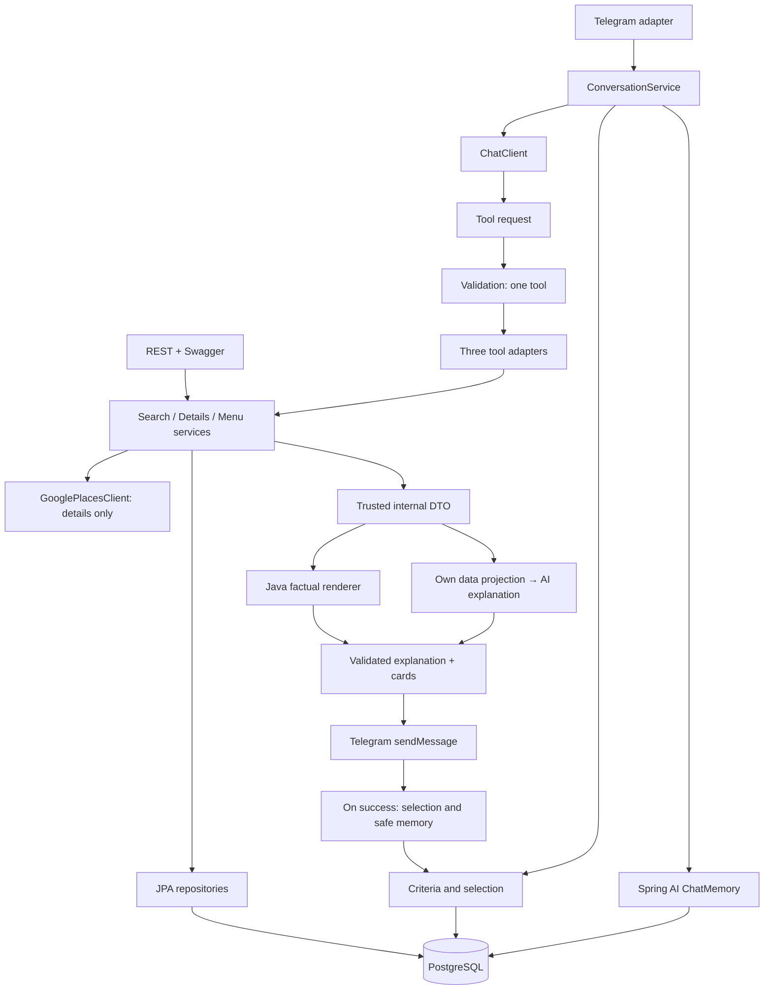

# Архитектура

Редакция: 2026-10-01. Проектные решения, без реализации. Scope и DoD: [PRODUCT.md](PRODUCT.md). Contracts AI: [AI.md](AI.md). Схема: [DATABASE.md](DATABASE.md). Инфраструктура: [DEPLOYMENT.md](DEPLOYMENT.md).

## Modular monolith

Один Spring Boot application, один Maven module и одна PostgreSQL. REST и Telegram используют одни application services. Не нужны отдельные микросервисы, многомодульная сборка, event bus и универсальный hexagonal framework.

Приоритеты: correctness → simplicity → understandable architecture → testability → diploma value → maintainability. Enterprise robustness не определяет размер MVP.



Схема показывает потоки данных, а не круговую зависимость компонентов. ConversationService координирует один turn. Search/Menu/Details services не обращаются к ConversationService, Telegram или AI.

## Responsibility boundaries

| Компонент | Ответственность |
|---|---|
| AI | Понимание реплик, supported criteria/tags, выбор tool, выбор подтверждённых причин для объяснения |
| ConversationService | Memory/state, merge, один turn, вызов AI и разрешённых tools, отправка, сохранение показанной selection |
| ReferenceResolver | Ordinal/name → restaurantId внутри текущего чата |
| Search service | Валидация, hard filters, расчёт ориентировочной суммы, ranking |
| Menu service | Собственные позиции и фильтры partial menu |
| Details service | Собственные details, optional live Google enrichment |
| JPA/PostgreSQL | Собственные ресторанные факты, критерии и выбор |
| Spring AI JDBC memory | Ограниченный текстовый разговорный контекст |
| Google adapter | Place Details, mapping, timeouts, source/attribution; не каталог и не ranking |
| Java renderer | Названия, ID, адреса, блюда, цены, рейтинг, count, часы, телефоны, URL и подписи источников |
| Telegram adapter | Private chat check, updates, long polling, escaping, send; без business rules |
| REST adapter | DTO/validation, HTTP status; те же services напрямую |

## Dependency flow и пакеты

Adapters → application services → repositories / внешние clients. Правила поиска не зависят от Telegram DTO или Spring AI SDK. HTTP/LLM calls выполняются вне DB transactions.

Предлагаемые пакеты, не файлы для немедленного создания:

```text
restaurantbot
├── catalog        # restaurant/menu, JPA, own details
├── search         # criteria, filtering, deterministic ranking
├── conversation   # orchestration, state, ReferenceResolver
├── ai             # ChatClient integration, three tools, prompts
├── telegram       # transport and message rendering
├── google         # Places HTTP adapter and mapping
├── api            # REST DTO/controllers
└── config         # properties, Clock, beans
```

Не создавать interface/implementation пары для каждого service. Внешние AI/Google/Telegram границы должны быть подменяемы в tests; дополнительная абстракция оправдана только конкретной зависимостью.

## Правила поиска и рекомендаций

### Criteria

Поиск предназначен для конкретного посещения. Гости, общий бюджет, дата и время обязательны; cuisine и preferredTags опциональны. Нет BROWSE/VISIT modes, arbitrary DSL, coordinates/distance и нескольких городов. Отсутствующие обязательные поля → уточнение; /new начинает новый запрос.

Пределы: 1–6 гостей, BYN, Минск, сегодня + следующие 6 дней. Расчёты дат/часов используют Clock и Europe/Minsk. Неоднозначность «на человека / на всех» уточняется; в search DTO передаётся общий бюджет.

### Hard filters

1. Restaurant существует, active=true, принадлежит фиксированному каталогу Минска.
2. Указанная кухня считается обязательной; отдельный флаг strict/soft cuisine не нужен.
3. При бюджетном поиске есть собственный положительный estimatedAverageCheckByn с source/date.
4. Ориентировочная сумма = estimatedAverageCheckByn × guests; она не превышает totalBudgetByn.
5. Расписание содержит requested arrival datetime по имеющимся собственным данным.
6. Гости находятся в поддерживаемом диапазоне. Это не проверка вместимости или наличия столика.

Неизвестный чек не подтверждает бюджет; неизвестное расписание не подтверждает часы. Такой ресторан не проходит соответствующий hard filter. Неполное/отсутствующее меню само по себе не влияет на search.

Расписание: интервалы [open, close), учитываются интервалы через полночь и предыдущий weekday; open==close без явного решения запрещено. Проверяется возможность прибыть в указанное время, не длительность ужина. Собственное недельное расписание не гарантирует праздничные часы. При противоречии live Google и собственной карточки показать источники и совет проверить, не менять результат поиска скрыто.

### Soft criteria

AI преобразует обстановку/повод только в поддерживаемые RestaurantTag. Предлагаемый компактный набор: COZY, QUIET, ROMANTIC, CASUAL, FRIENDS, PREMIUM. Набор фиксируется до seed; изменение enum — изменение contract/data.

«Уютно», «романтично», «с друзьями» влияют на соответствие тегам. Пользовательскую просьбу о гарантированной тишине нельзя удовлетворить таким тегом.

### Deterministic ranking

Сохраняется простой MatchCount:

- +1 за каждое совпадение requested preferredTag.
- Кухня уже hard filter; второй раз за неё баллы не начисляются.
- Сортировка: MatchCount DESC → estimated total ASC → restaurantId ASC.
- При одинаковом входе и каталоге порядок одинаков.
- Возвращается до 3 вариантов; этот же порядок показывается в Telegram.
- Google rating в sorting не участвует.
- AI не выбирает другой набор ID и не переставляет список.

Меньшая оценка чека — понятный tie-break; не нужно специально приближать сумму к верхней границе бюджета. «Дешевле» в карточке означает только более низкую собственную оценку, а не любой возможный заказ. Отдельное сравнение прошлых подборок в MVP не требуется.

Java возвращает reason codes для объяснения: совпавшие теги, кухня, бюджет в рамках оценки, расписание по сохранённому источнику. AI использует только разрешённые причины. Точный explanation contract: [AI.md](AI.md#гибридный-flow-и-объяснение).

## REST API

| Method / path | Вход и результат | Ошибки / назначение |
|---|---|---|
| GET /api/v1/restaurants | Необязательная cuisine, page/size; страница собственных карточек | 200, 400; каталог для Swagger |
| GET /api/v1/restaurants/{id} | Own details; optional Google по явному запросу enrichment | 200, 404; 503 при недоступной БД |
| GET /api/v1/restaurants/{id}/menu | Необязательные dishType/maxItemPriceByn; partial menu + metadata | 200, 400, 404 |
| POST /api/v1/recommendations | Полные структурированные criteria; до 3 кандидатов и причины | 200, 400, 503 |

Пустая выдача — 200 с пустым списком. Известный restaurant с недоступным меню — 200 с понятным data status. Google failure при доступных own details — 200 с warning. Entities и provider DTO не возвращаются в API.

TASK-03 реализует menu GET: status AVAILABLE / NO_RESULTS / DATA_UNAVAILABLE, coverage,
source, verifiedAt, currency=BYN, notice, items. PARTIAL metadata при наличии остаются видимыми
в пустом результате; unknown restaurant → 404, invalid dishType/price → 400.
Фильтры/модель и controlled import принадлежат [DATABASE.md](DATABASE.md#menu-data-strategy).

POST recommendations оставлен для изолированной проверки Java logic и demo через Swagger. Это не AI endpoint. Telegram вызывает services напрямую, без HTTP-запроса к собственному приложению.

REST/Swagger непубличны; публичный chat/admin API отсутствует. Spring Security вне MVP; сетевой режим принадлежит [DEPLOYMENT.md](DEPLOYMENT.md#доступ-и-секреты).

## Внешние интеграции

### Google Places

Enrichment известного заведения по вручную проверенному googlePlaceId; mapping конкретного филиала. Place Details scope: rating, userRatingCount, currentOpeningHours, googleMapsUri. Предлагаемый field mask: id,rating,userRatingCount,currentOpeningHours,googleMapsUri. Дополнительные поля и текущий billing/availability проверяются в TASK-00; wildcard mask не используется. [Place Details](https://developers.google.com/maps/documentation/places/web-service/place-details)

Google не формирует каталог/меню, не участвует в ranking и не вызывается для каждого search candidate. Запрос выполняется только в details при необходимости. Текстовые reviews — SHOULD.

OwnData и GoogleData разделены. Google часть отображается Java, не передаётся в explanation call и не сохраняется в chat memory/собственном каталоге. Persisted place ID допустим в рамках policy; произвольный кэш другого content не проектируется. Source attribution и требования Terms/Privacy проверяются для фактического UI. [Places policies](https://developers.google.com/maps/documentation/places/web-service/policies)

### AI и Telegram

Один выбранный provider/model. ChatClient integration скрывает SDK/version-specific настройки от search services. Long polling библиотека выбирается в TASK-00 по совместимости и поведению обработки updates. Execution/memory rules: [AI.md](AI.md); transport: [DEPLOYMENT.md](DEPLOYMENT.md#telegram-long-polling).

## Errors и graceful degradation

| Ситуация | Поведение |
|---|---|
| Недостаточные/неоднозначные критерии | Уточнение; нет случайной выдачи |
| Неподдерживаемая валюта/город или tags | Понятное ограничение; нет скрытого перевода/придумывания tags |
| Нет совпадений | Сообщение об отсутствии; предложить пользователю изменить критерии |
| Неверный/неоднозначный reference | Уточнение; нет угадывания ID |
| Нет позиции в partial menu | «В сохранённой части меню ... не найдено» |
| Google timeout/403/429 | Own details + live недоступно; без бесконечных retries |
| AI first call недоступен/невалиден | Понятное временное затруднение; REST search продолжает работать |
| Explanation call недоступен/невалиден | Готовая factual card + стандартная Java фраза |
| БД недоступна | Controlled error; memory/LLM не заменяют факты |
| Telegram sendMessage явно неуспешен | Новую selection не сохранять как показанную |

Ошибки логировать по operation/correlation ID без токенов, полных prompts и provider payload. Дополнительный rule-based conversational engine, outbox и distributed delivery guarantees не нужны.

## ADR summary

| ADR | Решение | Причина и последствия |
|---|---|---|
| 001 | Один modular monolith | Один студент, один deploy; границы через пакеты |
| 002 | REST/Swagger вместо web UI | Telegram основной UI; Java logic можно демонстрировать отдельно |
| 003 | PostgreSQL + JPA + Flyway | Реляционные факты и явная схема; H2 только часть tests |
| 004 | 10–12 заведений, slice на 3 | Сокращает сбор данных без потери архитектурной ценности |
| 005 | Собственный estimated check на гостя | Меню не блокирует budget search; оценка не гарантия |
| 006 | Partial menu 5–10 позиций | Реалистичные данные; source/date обязательны |
| 007 | Три read-only tools | Meaningful Spring AI flow без лишней tool surface |
| 008 | Гибридный AI turn + Java facts | Модель объясняет подтверждённые причины; free factual prose не используется |
| 009 | JDBC memory + отдельная selection | Текстовая память не решает надёжно ordinal references |
| 010 | Минимальное состояние без TelegramUser | Нет профиля/preferences/history; chatId достаточно |
| 011 | Сохранение selection после sendMessage | Корректный обычный flow без delivery state machine |
| 012 | MatchCount, own check tie-break | Понятный deterministic ranking; Google-independent |
| 013 | Google только enrichment | Core search работает при failed gate и timeout |
| 014 | Version choice в TASK-00 | Не смешивать Boot/Spring AI lines; проверить весь dependency set |
| 015 | Long polling + один экземпляр | Не нужен публичный webhook; offset оставлен библиотеке, если достаточно |
| 016 | Docker Compose/Dokploy/VPS | Воспроизводимая дипломная доставка с persistent DB |
| 017 | Security/CI/TTL после MVP | Не блокируют основной сценарий при закрытом HTTP |

Отдельные ADR файлы сейчас не нужны; расширить конкретное решение при фактическом изменении.

## Применённая методология

Документы отредактированы по существующим проектным решениям; новый market analysis не проводился.

- Продукт: проверяемые критерии, явное evidence и открытые NEED, ограниченный scope.
- Инженерия: минимальная модель, service contracts, bounded tools, eval перед оптимизацией prompt приложения.
- Проверки: тесты и code review относятся к изменённым областям; deployment проверяется при реализации соответствующей задачи.
