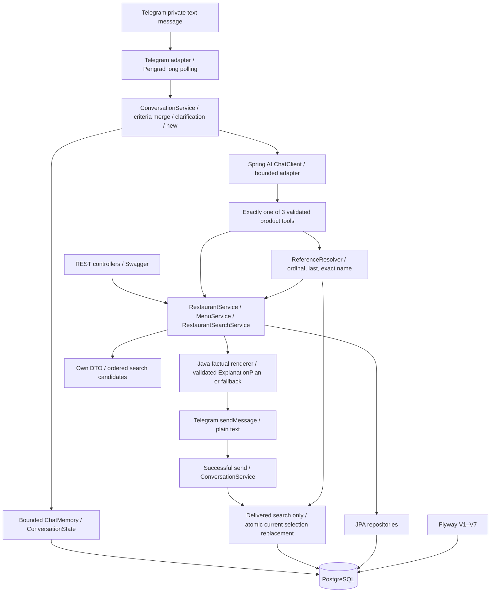

# Архитектура

Один Spring Boot application, один Maven module, modular monolith и одна PostgreSQL.
Продуктовый scope: [PRODUCT](PRODUCT.md). AI contracts: [AI](AI.md).
Схема и provenance: [DATABASE](DATABASE.md). Runtime: [DEPLOYMENT](DEPLOYMENT.md).

## Реализованная архитектура — IMPLEMENTED



Пакет `catalog` содержит Restaurant, menu, persistence и services; `search` — criteria,
filters/ranking и Clock configuration; `api` — тонкие REST controllers; `ai` —
bounded ChatClient adapter, три read-only tools, plan validation и Java renderers;
`conversation` — ConversationService, typed criteria merge, JDBC state/selection, ReferenceResolver и memory configuration;
`telegram` — private text filtering, library polling lifecycle и plain-text sendMessage.
Controllers не выполняют поиск и не возвращают JPA entities. Own DTO создаются внутри
read-only transactions, `open-in-view=false`. Денежные значения — BigDecimal.

Реализованный Telegram slice: private chat → TelegramUpdateHandler →
ConversationService → bounded memory/currentCriteria → SpringAiSearchAdapter →
validated partial criteria → Java merge → searchRestaurants → RestaurantSearchService → PostgreSQL →
trusted SearchResult → optional explanation + existing Java renderer → sendMessage.
Handler не добавляет model calls, search или retries и не читает repository.
Menu/details routing: тот же первый ChatClient call выбирает getRestaurantMenu либо
getRestaurantDetails → strict reference/filters/focus validation → ReferenceResolver
с текущим server chatId → resolved ID → MenuService/RestaurantService → own DTO →
Java plain-text renderer. Эти turns не вызывают RestaurantSearchService, criteria
merge/save или второй model call; не заменяют selection и не меняют selectionVersion.
Факты перечитываются, даже если memory содержит прежний ответ.
Для search ConversationService сохраняет валидные критерии в короткой transaction, отправляет
Java reply через transport callback вне transaction и при успешной отправке один раз
сохраняет user text + safe assistant projection и через SelectionService атомарно
заменяет текущую подборку реально показанными ID. `/new` очищает память/criteria/selection и
увеличивает generation без AI. Runtime: [DEPLOYMENT](DEPLOYMENT.md#telegram-long-polling--implemented).

## Компоненты и продолжение архитектуры

```text
Telegram private chat → ConversationService → Spring AI ChatClient
→ validated single tool request → existing application service → trusted DTO
→ optional Structured Output explanation → Java factual renderer → sendMessage
→ after successful send: one safe memory write; delivered search replaces selection
```

| Компонент | Ответственность | Состояние |
|---|---|---|
| RestaurantSearchService | Валидация, hard filters, estimated total, ranking | IMPLEMENTED |
| RestaurantService | Own catalog/details | IMPLEMENTED |
| MenuService / MenuImportService | Partial menu reading и controlled import | IMPLEMENTED |
| REST adapter | DTO, HTTP mapping, Swagger | IMPLEMENTED |
| LLM / ChatClient | Search/menu/details interpretation, supported arguments, выбор одного из трёх tools, причины search explanation | IMPLEMENTED; [limits/contract](AI.md) |
| ConversationService | Merge criteria, clarification, bounded memory/state, delivery callback, selection lifecycle, `/new` | IMPLEMENTED |
| SelectionService / SelectionItemRepository | Текущие показанные ID/positions, атомарная замена и version | IMPLEMENTED |
| ReferenceResolver | Ordinal/last/exact name → restaurantId в текущем чате | IMPLEMENTED; используется обоими follow-up tools |
| Java renderer | Search factual cards/explanation fallback, own details и PARTIAL menu | IMPLEMENTED |
| Telegram adapter | Private text check, long polling, plain-text send | IMPLEMENTED для conversation search/menu/details |
| Google adapter | Place Details enrichment известного ресторана | EXCLUDED FROM CURRENT MVP; NOT IMPLEMENTED |

Adapters → application services → repositories/clients. Services поиска/меню/details
не зависят от Telegram, ConversationService или Spring AI SDK. Telegram вызывает
ConversationService, который использует существующий SpringAiSearchAdapter, без HTTP к своему приложению.
LLM не получает repositories, EntityManager, SQL или доступ к БД.
Follow-up adapters получают только ReferenceResolver и существующие application
services. MenuDetails/RestaurantDetails — собственные DTO, без entities/provider
payload. Полные DTO остаются у Java renderer; manual tool callback отдаёт только
status, без отправки raw tool protocol модели. Menu source/date/PARTIAL сохраняются;
контакты/rating не придумываются при отсутствии данных. Contracts: [AI](AI.md#общие-tool-contracts).
HTTP/LLM calls выполняются вне DB transactions. Memory и reference contracts: [AI](AI.md).

ReferenceResolver читает текущие SelectionItem через SelectionService; имена
перечитывает через RestaurantService, без прямого RestaurantRepository/LLM/search.
Telegram и AI adapters не получают selection repository. REST recommendations
не обновляет selection. Renderer показывает все candidates в trusted SearchResult
без перестановки или усечения; этот же список ID передаётся в replace после send.
При clarification/invalid/no-search selection не меняется. Lifecycle, failure
behavior и известная граница crash между send и commit: [AI](AI.md#conversationstate-и-selection-context).

## Правила поиска и рекомендаций

### Criteria

Поиск относится к конкретному посещению. Обязательны guests, totalBudgetByn, date и time;
cuisine и preferredTags опциональны. Поддержаны Минск, BYN, 1–6 гостей, сегодня и
следующие шесть дней. Clock определяет текущую дату в Europe/Minsk независимо от ОС.
REST принимает уже структурированный запрос, не разбирает естественный язык.
Неоднозначность бюджета/времени и missing fields требуют уточнения;
Java сохраняет normalized currentCriteria и объединяет follow-up до search service.
Supplied invalid values отклоняются до merge; missing fields вычисляются заново.
Точные merge/ambiguity/memory contracts принадлежат [AI](AI.md).

### Hard filters

1. Ресторан существует в собственном фиксированном каталоге, active=true.
2. При заданной cuisine ресторан содержит эту кухню.
3. Есть собственный положительный estimatedCheckPerGuest с type/source/date;
   `estimatedCheckPerGuest × guests <= totalBudgetByn`.
4. Сохранённое расписание с source/date содержит requested date + local arrival time.

`guests` — входная валидация и множитель бюджета, не самостоятельный фильтр ресторана.
Данных capacity/maxPartySize/reservation limits нет; наличие столика не проверяется.
Неизвестный check или неизвестные hours не подтверждают соответствующее условие.
MenuItem rows и menu metadata не влияют на eligibility. Ограничения не ослабляются
при пустой выдаче или высоком soft score.

### Opening hours

Существующие opening_intervals задают weekday, opensAt, closesAt и closesNextDay.
Интервалы имеют границы `[open, close)`: открытие включено, закрытие исключено.
Учитываются текущий день и продолжение overnight interval предыдущего weekday.
Например, Friday 18:00 → Saturday 02:00 включает Friday 23:00 и Saturday 01:00,
но исключает Saturday 02:00 и 03:00. Поддержаны несколько интервалов и переход недели.
Интервал open==close запрещён; scheduling/calendar subsystem отсутствует.
Проверяется прибытие, не длительность ужина. Недельные часы не гарантируют праздничных.

### Soft criteria

Поддержаны RestaurantTag: COZY, QUIET, ROMANTIC, CASUAL, FRIENDS, PREMIUM.
После hard filtering вычисляются совпадения запрошенных тегов с curated tags каталога.
Несовпавший тег не исключает ресторан. Теги не гарантируют обстановку при посещении.

### Deterministic ranking

- MatchCount = число совпавших requested tags, по +1 за уникальный тег.
- Кухня уже hard filter, дополнительного балла за неё нет.
- Порядок: `matchCount DESC → estimatedTotalByn ASC → restaurant ID ASC`.
- Limit применяется после сортировки: максимум 3 кандидата.
- Одинаковые criteria и каталог дают одинаковый порядок.
- Google rating, случайность, LLM ranking, weights, embeddings, RAG и ML не используются.

Pipeline: catalog → hard filters → eligible restaurants → soft tag matching →
deterministic ranking → result. Чек используется как собственная оценка, не цена любого заказа.

### REST search contract

RestaurantSearchService читает небольшой каталог через RestaurantRepository и
выполняет фильтры/ranking в Java. SearchRequest содержит Integer guests, BigDecimal
общий бюджет, date (ISO date или контрактные TODAY/TOMORROW), time (HH:mm), optional
cuisine/preferredTags. TODAY/TOMORROW — фиксированные токены, не NLP parser.
Положительный бюджет допускает до двух знаков после запятой и нормализуется до scale=2
без округления. Дробный JSON guests не усекается, а отклоняется. Null/отсутствующий
preferredTags становится пустым enum set; дубли не увеличивают score.

SearchResult содержит normalizedCriteria, currency=BYN, ordered candidates и warnings.
Candidate: собственный RestaurantDetails DTO, estimatedTotalByn, matchCount,
allowedReasonCodes. Причины: CUISINE_MATCH при заданной кухне, BUDGET_MATCH,
HOURS_MATCH и `<TAG>_TAG_MATCH` только для совпавших запрошенных тегов.
AI explanation использует только допустимые причины: [AI](AI.md#гибридный-flow-и-объяснение).
Новых search tables/migrations, menu dependency и внешних API calls нет.

## REST API

Все четыре endpoints реализованы. REST/Swagger — локальная проверка Java logic;
HTTP доступ ограничен loopback. Сетевые требования: [DEPLOYMENT](DEPLOYMENT.md#доступ-и-секреты).

| Method / path | Вход / результат | HTTP |
|---|---|---|
| GET /api/v1/restaurants | page ≥0, size 1–100; active own catalog, id ASC | 200, 400 |
| GET /api/v1/restaurants/{id} | Own details по known ID | 200, 404 |
| GET /api/v1/restaurants/{id}/menu | Optional dishType/maxItemPriceByn; own partial menu | 200, 400, 404 |
| POST /api/v1/recommendations | Полные criteria, до 3 кандидатов и причины | 200, 400, 503 |

GET catalog пока не принимает cuisine filter. Details читает только собственные данные.
Search missing/invalid criteria → 400; отсутствие совпадений → 200 с пустым candidates;
DB/transaction failure → 503 без fallback facts. Entities/provider DTO наружу не выходят.
Menu status: AVAILABLE / NO_RESULTS / DATA_UNAVAILABLE. PARTIAL/source/date сохраняются
при пустом результате, если metadata есть; unknown restaurant → 404.
Menu filters и import semantics: [DATABASE](DATABASE.md#menu-data-strategy).

## Внешние интеграции

AI search — IMPLEMENTED: модель выбирает один searchRestaurants request и причины
объяснения; Java определяет реальные ID, цены, часы, адреса и порядок. Bounded adapter
вызывает application service напрямую, HTTP/model calls вне DB transactions.
Telegram conversation transport/memory и getRestaurantMenu/getRestaurantDetails —
IMPLEMENTED для собственных данных; всего tools ровно три.
Call limits/configuration: [AI](AI.md).
Google enrichment — EXCLUDED FROM CURRENT MVP; adapter и place mapping не реализованы.
Google не входит в текущий runtime path. Search/ranking независимы от Google;
own details остаются source of truth. [Продуктовое решение](PRODUCT.md#google-places--excluded-from-current-mvp).
При будущем пересмотре scope Google допустим только как enrichment details известного
собственного филиала по проверенному place ID, без участия в search/ranking,
передачи live payload модели или его сохранения в own DB/memory.

## Ключевые архитектурные решения

| Решение | Причина |
|---|---|
| Один modular monolith | Простые границы через пакеты, одна сборка и доставка |
| Собственная PostgreSQL + JPA + Flyway | Проверяемые факты и явная схема |
| Независимый estimated check | Budget search работает без меню |
| PARTIAL menu | Ограниченный проверяемый набор позиций |
| MatchCount, сумма, ID | Понятный и тестируемый deterministic ranking |
| Три read-only tools, Java facts | Ограниченная поверхность AI и проверяемый результат |
| Memory отдельно от selection | Текст не является источником ID/порядка/фактов |
| Selection после успешного send | Reference относится к реально показанным вариантам |
| Google исключён из текущего MVP | Core search/details используют собственные данные; возможный будущий Google — только enrichment |
| Long polling, один instance | Без публичного webhook и распределённой доставки |

Система не требует интерфейса для каждого класса, event bus, универсального framework
или дополнительных сервисов. Внешние границы должны быть подменяемы в тестах.
