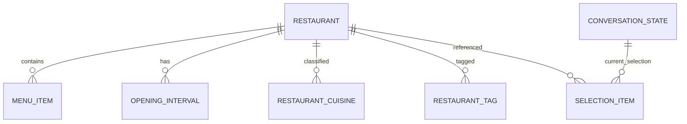

# Данные и PostgreSQL

Редакция: 2026-10-02. Каталог TASK-02 реализован; остальные части модели остаются планом. Статус приёмки: [BACKLOG.md](BACKLOG.md#task-02--restaurant-catalog). Search rules: [ARCHITECTURE.md](ARCHITECTURE.md#правила-поиска-и-рекомендаций). Разговорное поведение: [AI.md](AI.md). Scope: [PRODUCT.md](PRODUCT.md).

## Минимальная domain model

| Объект | Основные поля | Обоснование |
|---|---|---|
| Restaurant | id, seedKey, name, address, active, website/phone optional, catalogSource, catalogVerifiedAt | Конкретное реальное заведение/филиал |
| Restaurant check metadata | estimatedCheckPerGuest, checkEstimationType, checkSource, checkVerifiedAt | Независимый ориентир бюджета на одного гостя, BYN; PUBLISHED / DERIVED |
| Restaurant schedule metadata | hoursSource, hoursVerifiedAt | Происхождение собственного недельного расписания |
| Restaurant menu metadata | menuSource, menuVerifiedAt, menuCoverage=PARTIAL | Одно частичное меню без отдельной Menu entity |
| Restaurant enrichment mapping | googlePlaceId optional | Сопоставление с конкретным филиалом; не Google snapshot |
| OpeningInterval | restaurantId, weekday, opensAt, closesAt, closesNextDay | Собственное расписание, включая ночь |
| Cuisine / RestaurantTag | Set<Enum> на Restaurant; строки в collection tables | Поисковые признаки, не свободные runtime tags |
| MenuItem | id, restaurantId, name, category, dishType optional, priceByn, portion optional | Собственные 5–10 полезных позиций |
| ConversationState | chatId, generation, currentCriteria, selectionVersion, updatedAt | Одна актуальная строка на private chat |
| SelectionItem | chatId, selectionVersion, position, restaurantId | Только последняя показанная подборка |
| Spring AI JDBC memory rows | Официальные поля выбранной версии | Framework storage, не дополнительная JPA entity |

Отдельные TelegramUser, UserProfile, Favorite, RecommendationHistory, delivery status/checkpoint entities отсутствуют. Также нет Google rating/review таблиц, MenuVersion и универсального datasource registry.

## Данные и их происхождение

### Каталог

MVP: 10–12 реальных заведений; первоначально 3 для проверки источников и vertical slice. Желательны разные кухни, ориентировочные чеки, часы и tags. Источник — сайт заведения или иной пригодный независимый источник, не LLM и не массовый Google import.

Для каждой записи указать конкретный филиал, адрес, source и дату реальной проверки. seedKey — стабильный внутренний ключ для controlled seed/import, name не unique. Tags не проставлять по выдумке модели; куратор фиксирует их по источнику/описанию и обозначает субъективность.

Все monetary values — BYN/BigDecimal, даты/время проверок — явные. verifiedAt означает выполненную проверку источника, не автоматический timestamp импорта.

В TASK-02 Restaurant.id — Long / BIGINT GENERATED BY DEFAULT AS IDENTITY. Cuisine и RestaurantTag — строковые enum collections; OpeningInterval — embeddable collection с weekday, opensAt, closesAt, closesNextDay. Optional website/phone, enrichment mapping и menu metadata пока не реализованы. Два GET endpoints читают собственные DTO через RestaurantService: каталог active=true с page/size (size 1–100, порядок id ASC) и details по id с 404 для неизвестного id. Cuisine filter относится к последующему поиску. Entities и seedKey в REST response не передаются.

### Estimated-check strategy

estimatedCheckPerGuest означает **ориентировочную сумму на одного гостя** в согласованном сценарии обычного посещения. Это собственное curated значение; не цена конкретной корзины и не статистически подтверждённый средний чек. Имя estimatedAverageCheckByn в прежних contracts обозначает то же значение; реализованное поле — estimatedCheckPerGuest, SQL — estimated_check_per_guest NUMERIC(10,2).

Предпочтительный источник — опубликованный ориентир заведения. Если публикуется диапазон, куратор выбирает и объясняет одно консервативное значение. Поле checkEstimationType явно различает **PUBLISHED** и **DERIVED**. Для DERIVED использовать реальные опубликованные цены и прозрачную ручную методику; сохранить состав расчёта, канал цен, source URL и дату проверки в checkSource. Это provenance curated значения, не новый runtime estimator/обязательная entity. Состав конкретного расчёта не является общей формулой приложения. Первоначальные данные: [proof-of-data](TASK-00-FEASIBILITY.md#11-restaurant-proof-of-data).

Для первых трёх DERIVED checks принят единый food-only сценарий: одна выбранная полноценная порция основного блюда + одна порция супа на гостя, без напитков, алкоголя, десерта, доставки и чаевых. Эти две категории доступны во всех трёх кухнях; одинаковый состав делает учебную оценку понятной и воспроизводимой. Это конкретный curated ориентир, не минимум, медиана, статистический или официальный средний чек. Официальный PUBLISHED показатель на проверенных страницах не найден. Java получает готовый BigDecimal; расчёт по меню в runtime отсутствует.

Первоначальный seed проверен 2026-10-02:

| Филиал | Cuisine | Чек на гостя | Источник / ограничение |
|---|---|---|---|
| Васильки — Минск, проспект Независимости, 16 | BELARUSIAN | 39.80 BYN, DERIVED | [Драники с мачанкой по-белорусски](https://vasilki.by/img/menu/Драники_1.jpg) 22.90 + [щи с лесными грибами](https://vasilki.by/img/menu/Супы_1.jpg) 16.90 |
| Pizza Tempo — Минск, ул. Карла Маркса, 26 | ITALIAN | 32.70 BYN, DERIVED | [Паста Карбонара](https://tempo.by/img/menu/пасты%201.jpg) 19.50 + [суп-крем из шампиньонов с сыром с голубой плесенью](https://tempo.by/img/menu/супы%201.jpg) 13.20 |
| Хинкальня — Минск, проспект Дзержинского, 104 | GEORGIAN | 44.00 BYN, DERIVED | [Меню филиала](https://www.titanminsk.by/kafe-i-restoranyi/restoran/menyu/): шашлык из свинины 25.00 + харчо 19.00; без напитков, алкоголя, доставки и чаевых |

Branch applicability для двух сетевых чеков подтверждена на уровне официального общего меню: [Васильки](https://vasilki.by/) и [Pizza Tempo](https://tempo.by/) публикуют один набор страниц основного меню без выбора филиала или отдельных цен филиалов; оба адреса находятся в каталоге соответствующей сети. Выбор категории меню не зависит от выбранного адреса. Отдельного меню филиала сайт не публикует; это сетевой источник, а не индивидуальное подтверждение со стороны персонала. Исключение акции Minsk Card у Васильков на Независимости, 16 относится к скидке; в оценке скидки не учтены. Delivery menus не использованы. Хинкальня использует меню конкретного филиала. Все четыре check-поля заполнены у всех трёх записей; checkVerifiedAt=2026-10-02.

Catalog/hours source и дата сохранены для всех трёх филиалов. Васильки: Вс–Чт 08:00–23:00, Пт–Сб 08:00–01:00 следующего дня; Pizza Tempo: ежедневно 10:00–23:00; Хинкальня: ежедневно 12:00–00:00 следующего дня. COZY/FRIENDS проставлены только Хинкальне по [описанию филиала](https://www.titanminsk.by/kafe-i-restoranyi/restoran/); это curated tags. У остальных tags пусты.

Java search использует:

```text
estimatedTotalByn = estimatedCheckPerGuest × guests
estimatedTotalByn <= totalBudgetByn
```

В runtime search нет median menu baskets, required main/drink counts, 10% reserve и зависимости от MenuItem. Ручной DERIVED расчёт при подготовке curated данных допустим по правилу выше; search использует уже сохранённый независимый чек. Формула проверки и ranking принадлежат [ARCHITECTURE.md](ARCHITECTURE.md#правила-поиска-и-рекомендаций).

Чек должен иметь source и checkVerifiedAt. Если проверить его не удалось — оставить неизвестным, а не 0; такой ресторан не подтверждает budget filter. Проверять источники перед demo; автоматический TTL для menu/check не нужен в MVP. Старые даты остаются видимыми, актуальность не гарантируется датой импорта.

Пользовательская подпись: «Ориентировочный чек, не гарантия итоговой суммы». Не сравнивать несопоставимые источники как доказательство цены любого заказа.

### Menu data strategy

5–10 полезных позиций на заведение, coverage всегда PARTIAL. Источник и дата относятся к сохранённой части меню. Полное меню, автоматический scraping и внешний API меню не нужны.

Хранить фиксированные опубликованные BYN-цены. Не выдавать цену «за 100 г» как цену целого блюда; такие позиции лучше не включать в учебный набор. portion optional хранится только если указан в источнике.

dishType — маленький фиксированный enum для доказуемых запросов вроде PASTA/BURGER. Name/category сохраняются из собственного источника; ingredients/allergens/availability не выводятся LLM.

Если menu нет или оно неполное, search продолжает пользоваться estimated check. При отрицательном menu query формулировка: «В сохранённой части меню такое блюдо не найдено». Это не доказательство отсутствия блюда вообще.

### Controlled seed/import

Базовые три записи TASK-02 поставляются отдельной Flyway data migration V2 после schema V1. Это неизменяемый первоначальный dataset: чистая БД получает одинаковые записи, повторный старт не повторяет INSERT. Последующие изменения данных оформляются новой migration или controlled import; применённый V2 не переписывается. Приложение не вызывает внешние API при seed и не использует startup runner.

В TASK-03 для дальнейшего controlled import предусмотрен вручную подготовленный JSON + валидированный import по seedKey. Допустим CSV вместо JSON, но поддержка обоих форматов не обязательна.

- Без удалённого URL fetching/scraping.
- Проверить поля, цены, enum values и links до обновления.
- Повторный импорт не создаёт дубли.
- Невалидный dataset не оставляет частично обновлённый каталог.
- Restaurant и menu обновляются по заранее понятным stable keys.
- Регулярно меняющиеся цены/источники не зашиваются в уже применённые schema migrations.

Начальный SQL dataset входит в application resources. JSON import пока не реализован.

## Разговор и последняя подборка

### ConversationState

| Поле | Значение |
|---|---|
| chatId | BIGINT, PK; Telegram private chat, авторитетный scope |
| generation | Неотрицательный счётчик reset, часть derived conversationId |
| currentCriteria | Компактная структура normalized guests/budget/date/time/cuisine/tags |
| selectionVersion | Неотрицательный счётчик показанной selection |
| updatedAt | Время последнего изменения; troubleshooting, будущий cleanup |

Одна строка на чат; нет истории generations. conversationId вычисляется из chatId/generation, отдельно хранить его не обязательно. currentCriteria допустимо хранить JSON/JSONB с явной сериализацией: это единый state, который не участвует в SQL search ресторана. В отличие от него cuisine/tags Restaurant хранятся нормализованно.

Нет expiresAt, expectedFields, workflow status, delivery status, userId и наборов snapshot. Missing fields вычисляются по criteria. updatedAt не означает обязательный scheduled TTL.

### SelectionItem

chatId обязателен в дополнение к предложенным selectionVersion/position/restaurantId: version и position не уникальны между чатами. Он служит FK на ConversationState и предотвращает смешение selection разных пользователей.

Хранится максимум 3 строки на чат. PK: (chat_id, position); selection_version копирует текущую ConversationState.selectionVersion. При новой успешной выдаче в одной короткой DB transaction увеличить version, удалить прежние строки, вставить реально показанные ID. История отсутствует; согласованность version обеспечивается этой транзакцией.

Только position и restaurantId: не копировать check/cuisine/tags и Google в snapshot. Детали перечитываются из каталога. Lifecycle и sendMessage описаны только в [AI.md](AI.md#conversationstate-и-selection-context).

## ER



Spring AI memory связана логически по derived conversationId; schema framework не получает искусственную FK/duplicating entity. После /new её old conversation rows очищаются через ChatMemory API.

## Constraints

- Restaurant.seedKey unique/not null; name не unique.
- googlePlaceId nullable unique, когда задан; mapping проверяется вручную.
- estimatedCheckPerGuest nullable либо >0; amount/type/source/verifiedAt либо все NULL, либо полностью заполнены; type только PUBLISHED / DERIVED.
- MenuItem.priceByn >0; валютный смысл фиксирован BYN в контракте.
- Для сохранённых menu items необходимы menuSource, menuVerifiedAt, PARTIAL metadata.
- OpeningInterval.weekday в диапазоне enum; открытие/закрытие валидируются, overnight явно указан.
- Enum values хранятся строками, не ordinal; unique (restaurant_id, enum_value) в collection tables.
- ConversationState.chatId PK; generation/selectionVersion ≥0.
- SelectionItem PK (chat_id, position); position 1–3; selectionVersion >0.
- FK MenuItem/OpeningInterval/enum collections → Restaurant.
- FK SelectionItem → ConversationState и Restaurant. Restaurant в MVP деактивируется, а не физически удаляется при наличии ссылок.

Constraints не доказывают актуальность источника и существование места; это проверяется куратором и dataset validation.

## Индексы и types

- FK access indexes: MenuItem.restaurant_id, OpeningInterval.restaurant_id, SelectionItem.restaurant_id.
- Collection tables покрываются составными PK (restaurant_id, enum_value).
- Поиск ConversationState по chatId покрыт PK; SelectionItem по chatId/position — составным PK.
- Spring AI memory indexes — из официальной схемы pinned version.
- Нет expiresAt index, history index и ranking tuning для десятка заведений.
- BIGINT/Long для Telegram IDs, NUMERIC/BigDecimal для BYN.
- Не сохранять JPA entities в tool/API responses.

## Flyway plan

Реализованные migrations и дальнейший план:

| Migration | Scope | Задача |
|---|---|---|
| V1 create restaurant catalog | restaurants, restaurant_cuisines, restaurant_tags, opening_intervals; catalog/check/hours metadata | TASK-02, реализована |
| V2 seed first three restaurants | Первоначальные 3 филиала; 21 недельный интервал | TASK-02, реализована |
| Следующая schema migration | MenuItem и metadata | TASK-03, план |
| Последующие migrations | State, exact JDBC memory schema, SelectionItem | TASK-07/08, план |

Polling checkpoint migration заранее не нужна. Если выбранная Telegram library не покрывает необходимый offset, добавить минимальное техническое хранение только по доказанному требованию TASK-11; не новую domain subsystem.

Hibernate ddl-auto=validate. Автоматическое создание memory tables framework отключается version-specific настройкой; schema управляет Flyway. Применённые versioned migrations не переписываются — новая миграция исправляет схему.

Нумерация — целевой порядок, не причина задерживать ранний slice. TASK-04–06 не зависят от MenuItem и могут быть выполнены до TASK-03; при такой последовательности назначить фактические версии миграций по порядку появления, сохранив scope.

## PostgreSQL acceptance

H2 полезна для части простых JPA tests; она не доказывает PostgreSQL JSON mapping, SQL migrations и JDBC memory compatibility. Минимальная PostgreSQL проверка:

- Flyway на пустой БД и повторный старт.
- Реальный seed/import, estimated check и search.
- State/selection/memory переживают restart.
- /new действительно очищает старый разговор.
- Два chatId не смешиваются.
- Failed send не заменяет selection; successful send сохраняет правильный порядок.

Общий test scope и task AC: [BACKLOG.md](BACKLOG.md).

Тесты каталога используют тот же Flyway SQL и Hibernate validate на H2 без compatibility mode. Для повторения PostgreSQL проверки нужна отдельная пустая development/test БД. Подключение передаётся извне (не использовать рабочую БД):

```powershell
.\mvnw.cmd test "-Dtest=RestaurantCatalogTest" `
  "-Dspring.datasource.url=$env:DB_URL" `
  "-Dspring.datasource.username=$env:DB_USER" `
  "-Dspring.datasource.driver-class-name=org.postgresql.Driver"
```

Пароль передать через SPRING_DATASOURCE_PASSWORD в environment, без CLI argument. Тесты проверяют migration/reapply, seed, mappings, constraints и REST; изменения тестовых строк откатываются. Проверки state/memory/search остаются соответствующим следующим задачам.
